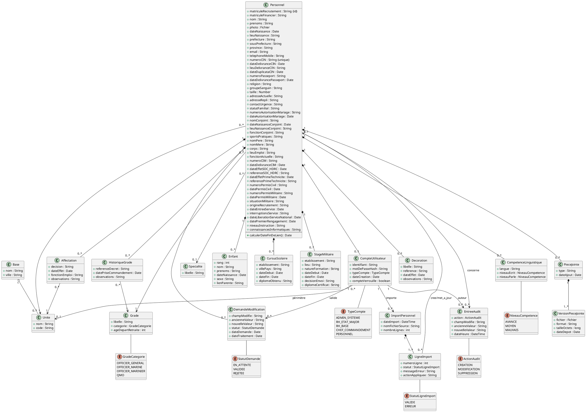

# Analyse UML — Application GRH EMMN

Diagramme de classes UML dérivé du cahier des charges « Application web de Gestion des Ressources Humaines de l'État-Major de la Marine Nationale (EMMN) ».

## 1. Synthèse du domaine métier

Le CDC décrit une application de **gestion des dossiers du personnel militaire** de la Marine Nationale (EMMN, BANA, 2ème BIMA), destinée à remplacer une base Access mono-poste. Le cœur du domaine est la **fiche individuelle** d'un militaire (identité, situation familiale, carrière, formation, affectations, décorations, pièces jointes), organisée en historiques (rien n'est écrasé) et rattachée à une structure organisationnelle (base → unité) et à un référentiel de grades. S'y ajoutent trois processus métier nouveaux, explicitement demandés : **import/export Excel en masse**, **gestion de comptes et de droits par périmètre organisationnel**, et **workflow de validation** des modifications proposées par les agents eux-mêmes.

## 2. Acteurs et fonctionnalités identifiés

**Acteurs** (§2.6) :
- Administrateur système
- RH État-Major (accès à tout le personnel)
- RH de base/unité (accès filtré à sa base/unité)
- Chef/Commandement (lecture seule, filtrée par niveau)
- Agent (« compte Personnel », consultation/MAJ limitée de sa propre fiche)

**Fonctionnalités principales** : tableau de bord statistique, fiche personnel en 8 onglets, import/export Excel avec détection de doublons, recherche multicritère et floue, états/éditions imprimables (PDF/Excel), alerte automatique de fin de lien, gestion des droits par périmètre, workflow de validation des modifications d'agent, journal d'audit, listes de référence paramétrables (grades, unités, spécialités).

## 3. Concepts/classes métier identifiés (avec justification)

| Classe | Justification (CDC) |
|---|---|
| **Personnel** | Cœur du système : « gérer les dossiers du personnel » (§1), fiche individuelle (§2.2) |
| **Base** | Organisation en 3 bases nommées explicitement (§1, §2.1) |
| **Unite** | « Liste du personnel par base puis par unité », « paramétrable » (§2.1) |
| **Grade** | Catégories de grade citées, liste déroulante paramétrable, sert au calcul de l'âge de retraite (§2.1, §2.3, §2.6) |
| **Specialite** | Liste déroulante paramétrable citée explicitement (§2.6a) |
| **Enfant** | « Tableau : rang, nom, date de naissance, sexe, lien de parenté » (§2.2b) |
| **HistoriqueGrade** | « Historique des grades successifs » distinct du grade actuel (§2.2c) |
| **CursusScolaire** | « Cursus scolaire/universitaire » (§2.2d) |
| **StageMilitaire** | « Stages et formations militaires », champs distincts du cursus scolaire (§2.2d) |
| **CompetenceLinguistique** | « Langues (écrit/parlé) » — structure répétitive par langue (§2.2e) |
| **Affectation** | « Affectations successives », historique complet non écrasé (§2.2f) |
| **Decoration** | « Décorations successives » (§2.2g) |
| **PieceJointe** | Téléversement de documents, requis explicitement (§2.2h) |
| **VersionPieceJointe** | « Historique des versions » demandé explicitement pour les pièces jointes (§2.2h) |
| **CompteUtilisateur** | « Chaque agent doit disposer d'un compte personnel », profils multiples (§2.6) |
| **DemandeModification** | Workflow de validation des modifications proposées par l'agent (§2.6b) |
| **EntreeAudit** | Journal d'audit explicitement demandé (§2.6c) |
| **ImportPersonnel** | Historique des imports demandé explicitement (§2.5) |
| **LigneImport** | Rapport d'erreurs ligne par ligne, choix création/MAJ par doublon (§2.5) |

Aucune classe générique (User, Role, Permission, Notification, Service, Repository…) n'a été ajoutée par automatisme : `CompteUtilisateur` remplace un couple User/Role générique parce que le CDC décrit un nombre fini et fermé de profils métier, pas un système de permissions granulaire à concevoir.

## 4. Attributs et responsabilités (synthèse)

- **Personnel** : identité, filiation, coordonnées, état civil/famille (hors enfants), pièces d'identité, renseignements militaires courants (corps, matricules, spécialité, fonction actuelle, situation militaire, dates de service), niveau d'instruction, connaissances informatiques — c'est-à-dire tous les champs **non répétitifs** de la fiche (blocs a et c, hors historique de grades). Responsabilité : représenter l'état courant du dossier d'un militaire.
- **Base / Unite / Grade / Specialite** : référentiels paramétrables sans développement (§2.1, §3 « Maintenabilité »).
- **Enfant, HistoriqueGrade, CursusScolaire, StageMilitaire, CompetenceLinguistique, Affectation, Decoration** : historiques attachés à un Personnel, jamais partagés entre personnes → composition.
- **PieceJointe / VersionPieceJointe** : document logique et ses versions successives.
- **CompteUtilisateur** : identifiants, type de profil, périmètre (unité) pour les profils filtrés.
- **DemandeModification** : champ visé, ancienne/nouvelle valeur, statut, dates.
- **EntreeAudit** : traçabilité générique de toute action CRUD.
- **ImportPersonnel / LigneImport** : traçabilité d'un import Excel et de chacune de ses lignes.

## 5. Relations et cardinalités

- `Base` 1 —— 0..* `Unite` (agrégation : une unité est rattachée à une base mais peut survivre à une réorganisation)
- `Unite` 1 —— 0..* `Personnel` (affectation actuelle) ; `Grade` 1 —— 0..* `Personnel`
- `Personnel` 1 *— 0..* `Enfant`, `Affectation`, `Decoration`, `HistoriqueGrade`, `CursusScolaire`, `StageMilitaire`, `CompetenceLinguistique`, `PieceJointe`, `DemandeModification` (composition : ces éléments n'existent pas sans le personnel parent — « historique complet »)
- `PieceJointe` 1 *— 1..* `VersionPieceJointe` (composition : une version n'a pas de sens sans son document)
- `Affectation` 0..* —— 1 `Unite` ; `HistoriqueGrade` 0..* —— 1 `Grade` ; `Personnel` 0..* —— 0..1 `Specialite`
- `Personnel` 1 —— 0..1 `CompteUtilisateur` (composition : compte créé automatiquement avec la fiche, §2.6c)
- `CompteUtilisateur` 0..* —— 0..1 `Unite` (périmètre, uniquement pour RH de base/Chef)
- `CompteUtilisateur` 1 —— 0..* `DemandeModification` (validateur RH), `EntreeAudit` (auteur), `ImportPersonnel` (importateur)
- `ImportPersonnel` 1 *— 1..* `LigneImport` (composition : une ligne d'import n'existe pas hors de son import)
- `LigneImport` 0..* —— 0..1 `Personnel` (fiche créée/mise à jour, nulle si ligne en erreur)

## 6. Diagramme de classes UML (PlantUML)

## 7. Hypothèses (à valider avec le CDC ou le tuteur)

Ces éléments ne sont pas explicitement détaillés dans le CDC et ont dû être déduits :

- **CompteUtilisateur ↔ Personnel en 1—0..1** : le CDC dit « chaque agent doit disposer d'un compte », sans préciser si les comptes admin (RH État-Major, admin système, etc.) sont eux-mêmes rattachés à une fiche Personnel ou gérés à part. Hypothèse retenue : tous les comptes sont rattachés à une fiche Personnel (cohérent avec « compte créé automatiquement lors de l'ajout de la fiche »).
- **Cursus scolaire vs stage militaire en deux classes distinctes** : le CDC les liste séparément (d), avec des champs partiellement différents (« décision d'envoi » propre au stage militaire) ; ce choix évite de forcer une classe unique artificielle, mais une fusion reste défendable si le tuteur le préfère.
- **`LigneImport`** : le CDC décrit le comportement (rapport d'erreurs, choix création/MAJ par doublon) mais ne nomme pas explicitement cette entité ; elle a été déduite pour représenter la traçabilité ligne par ligne demandée.
- **`EntreeAudit` liée à `Personnel`** : le CDC ne précise pas si le journal d'audit couvre uniquement les fiches personnel ou toutes les entités du système ; l'association a été limitée à Personnel car c'est le seul objet explicitement mentionné en contexte d'audit (§2.6c).
- **`Specialite` en classe séparée plutôt qu'attribut texte** : déduit de la mention « listes déroulantes (grades, spécialités…) » paramétrables (§2.6a), par cohérence avec Grade et Unité.
- **Cardinalité `Unite` 1—0..* `Personnel`** : suppose qu'un militaire a une seule unité d'affectation courante à la fois (non explicité mais implicite dans une organisation militaire hiérarchique).

## 8. Contrôle de cohérence et problèmes du CDC

- Toutes les fonctionnalités majeures (§2.1 à §2.6) sont représentées par au moins une classe ou une relation ; aucune classe n'a été ajoutée sans justification citée en section 3.
- **Redondance potentielle non résolue par le CDC lui-même** : le bloc « Renseignements militaires » (c) contient déjà `lieuEmploi` et `fonctionActuelle`, alors que le bloc « Affectations successives » (f) historise exactement les mêmes informations (« lieu d'affectation, fonction/emploi »). Le CDC ne précise pas si les champs courants de (c) doivent être calculés à partir de la dernière `Affectation`, ou saisis indépendamment (risque d'incohérence si les deux ne sont pas synchronisés). **Point à clarifier avec le RH avant développement.**
- Le CDC ne précise pas la granularité exacte des droits d'un « Chef/Commandement » (« selon son niveau de commandement ») : le périmètre `CompteUtilisateur → Unite` modélisé est une simplification à affiner par la « matrice champ × rôle » que le CDC demande lui-même de formaliser séparément (§2.6c) — volontairement non modélisée ici en détail, comme suggéré par le CDC.
- Aucune classe générique non justifiée (User, Role, Permission, Notification, Log, Payment, Address, Document...) n'a été introduite ; là où un concept proche existait (compte, audit, pièce jointe), il a été spécialisé et justifié par une exigence précise plutôt qu'ajouté par réflexe.
